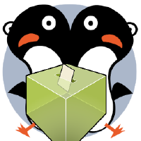

# Aplicación Elecciones 2015 Rector/a UGR
App para seguir las elecciones 2015 a rector/a de la Universidad de Granada




## ¿Cómo compilar la aplicación?

Necesitarás "Apache Córdova". Por ejemplo, en Ubuntu tendrás que ejecutar:

```bash
sudo apt-get update
sudo apt-get install nodejs nodejs-legacy npm
sudo npm install -g cordova
```

Añade las plataformas para las que desees generar la aplicación. Por ejemplo, para Android:

```cordova platform add android```

[Mira aquí más plataformas que puedes compilar](https://cordova.apache.org/docs/en/4.0.0/guide_cli_index.md.html)

Constrúyela con ``cordova build`` (o si solo quieres para una una plataforma ``cordova build android``, por ejemplo).

Para emular ejecuta ``cordova emulate plataforma`` o si quieres ejecutarlo en un dispositivo ``cordova run plataforma`` (por ejemplo, ``cordova run android``)


Recuerda que, antes de ejecutar la aplicación, necesitarás añadir los ficheros del submódulo que se encuentra en la carpeta "www". Para ello, ejecuta:

```bash
git submodule init
git submodule update
```
